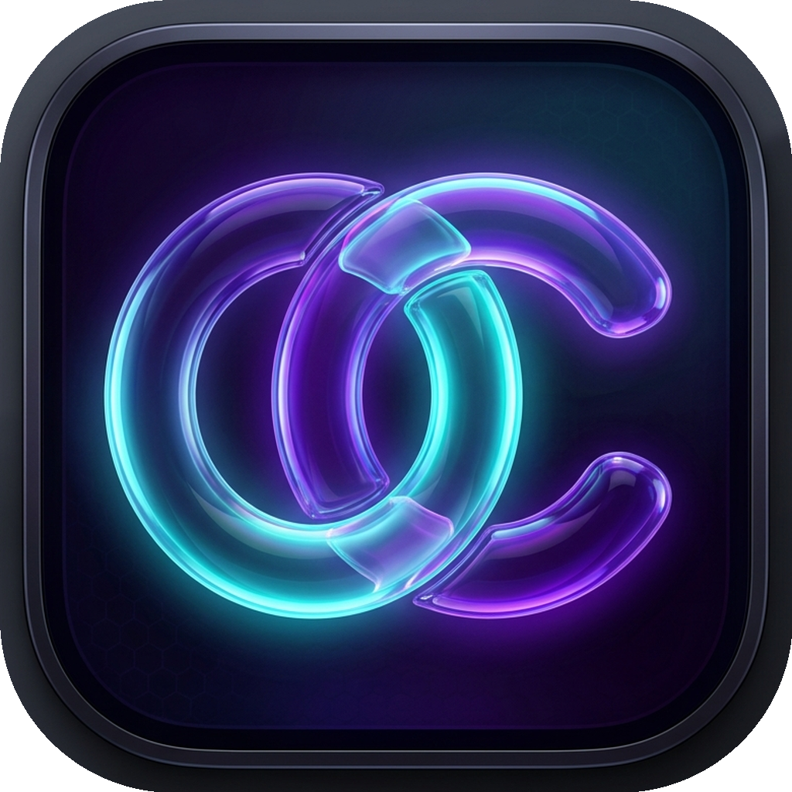

<div align="center">
  
  
  # Claude Connector
  
  **The ultimate multi-account desktop client for Claude.ai.**  
  *Run multiple accounts simultaneously, bypass limits, and share context across chats seamlessly.*
  
  <br>
  
  [](https://github.com/yoneshmurugan/Claude-connector/releases/latest)
  [](https://github.com/yoneshmurugan/Claude-connector/releases/latest)

</div>

---

## Why use Claude Connector?

If you rely on Claude heavily, you know the pain of hitting message limits and having to manually log out and log back in with a different account. **Claude Connector** solves this entirely. 

Designed with a beautiful, lightweight macOS-native interface, this app allows you to:
* **Run up to 10 Accounts at Once:** Each account is completely isolated. Stay logged into 10 different accounts at the exact same time without them interfering with each other.
* **Bridge Your Conversations (Extend Convo):** Hit a message limit on Account 1? With one click, the app automatically copies your current conversation and pastes it directly into Account 2 so you never lose your train of thought.
* **Build a Context Vault:** Save your favorite prompt instructions or long code snippets as Markdown files directly on your computer. Inject them into any Claude chat instantly.
* **Bypass Restrictions:** The app spoofs its headers so Claude (and Cloudflare) sees your connection as a standard Google Chrome browser, preventing you from being blocked as a "bot."

## How to Install (For Regular Users)

1. **Download:** Click one of the Download buttons at the very top of this page.
2. **Mac Users:** Open the downloaded `.dmg` file and drag the Claude Connector icon into your Applications folder.
3. **Windows Users:** Extract the downloaded `.zip` file and double-click `Claude Connector.exe` to run the app instantly!
4. **Login:** Click the `+` button in the app sidebar to add an account. *Important: You must log in using your Email address, as Google Login is blocked by Google for security reasons.*

---

<br>

# Developer Guide

Want to run the app from the source code or build it yourself? Follow the steps below.

### Installation
1. Clone the repository:
   ```bash
   git clone https://github.com/yoneshmurugan/Claude-connector.git
   cd Claude-connector
   ```
2. Install dependencies:
   ```bash
   npm install
   ```
3. Run the app in development mode:
   ```bash
   npm start
   ```

### Building for Production
This project uses `electron-builder` to package standalone desktop executables. 

**To build the macOS Installer (.dmg):**
```bash
npm run build:mac
```

**To build the Windows Executable (.zip):**
```bash
npm run build:win
```
Find your compiled builds in the `dist/` folder.

---

## Architecture Overview

* **Main Process (`src/main/`):** Manages the Electron lifecycle, window creation, native file system access for the Context Vault, and intercepting/spoofing HTTP headers.
* **Renderer Process (`src/renderer/`):** Manages the frontend UI. It dynamically spawns `<webview>` tags and handles the logic for switching tabs, updating the Vault UI, and triggering IPC events.
* **Injection Scripts (`src/scripts/`):** JavaScript files that are executed *inside* the isolated Claude webviews using `webview.executeJavaScript()`. 

---

## ⚠️ Disclaimer

**This is an unofficial, community-built tool.** 
Claude Connector is not affiliated with, endorsed by, or sponsored by Anthropic. 

By using this application, you are wrapping the Claude.ai web interface and utilizing DOM scraping techniques. This violates Anthropic's Terms of Service regarding automated access and web scraping. 

**Use this tool strictly at your own risk.** Excessive automation or superhuman interaction speeds may result in your Claude accounts being flagged or banned by Anthropic. The creators of this repository hold no liability for lost accounts or data.
